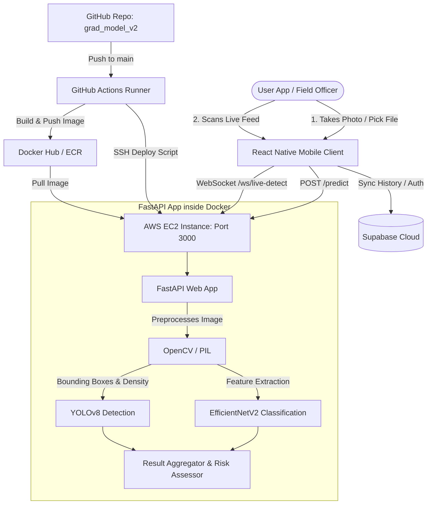

# Water Hyacinth Monitoring & Detection System 🌿📱

An end-to-end, state-of-the-art mobile application and deep learning inference backend system designed to monitor, classify, and detect invasive **Water Hyacinth** (*Eichhornia crassipes*) in freshwater bodies. 

The system leverages **React Native (Expo)** for the mobile application, a high-performance **FastAPI** web service for inference, and runs on an **AWS EC2** instance with full containerization and automated CI/CD deployment pipelines.

---

## 🏗️ System Architecture

The following diagram illustrates how the components of the ecosystem communicate:



---

## 📱 Mobile App Features (Expo React Native)

The mobile client is optimized for field-officer workflows in remote areas, providing:
1. **Still-Photo Classification**: Upload images from the gallery or capture them using the device camera.
2. **Real-time Live Camera Detection**: Smooth, low-latency live camera stream running continuous object detection and classification.
3. **Response-Driven WebSocket Loop**: Instead of laggy timer-based frame capture, the app uses a feedback-driven stream where the next frame is captured and sent only after the previous frame's response is received (minimum 80ms gap to prevent cpu thermal throttling).
4. **Dynamic Capture Resolution**: The quality selector scales the camera sensor resolution (`pictureSize`) and compression quality dynamically:
   - **Fast Mode**: Captures at `352x288` resolution, `0.1` JPEG quality (ideal for poor cellular networks).
   - **Balanced Mode**: Captures at `640x480` resolution, `0.3` JPEG quality.
   - **Best Mode**: Captures at `1280x720` resolution, `0.6` JPEG quality (ideal for high-accuracy details).
5. **Interactive Border Toggle**: On the still-photo results page, users can toggle bounding box borders ON/OFF to inspect the original underlying photo details.
6. **Built-in Flashlight Control**: Toggle the device torch directly inside live detection mode.
7. **Offline History & Cloud Sync**: Local records are maintained and automatically synced with **Supabase Database & Auth**.

---

## ⚡ Backend API Features & Technologies (`grad_model_v2`)

The backend API is hosted at `https://github.com/yousefdawood7/grad_model_v2` and offers low-latency deep learning inference.

### 🛠️ Technology Stack
* **Language**: Python 3.10+
* **Framework**: **FastAPI** — high performance, auto-documented (Swagger/OpenAPI), asynchronous.
* **Server**: **Uvicorn** — ASGI web server.
* **Deep Learning Models**:
  - **EfficientNetV2**: Classifies whether the plant is `water_hyacinth` or `non_water_hyacinth` and outputs a classification confidence score.
  - **YOLO (Ultralytics)**: Detects bounding boxes around water hyacinth patches, returning box coordinates `[x1, y1, x2, y2]`, detection confidence, and the number of regions.
* **Image Processing**: **OpenCV** (cv2) & **Pillow** (PIL) for base64 decoding, colorspace conversion, and cropping.

### 🧪 ML Inference & Risk Scoring Logic
The backend processes the raw model outputs into actionable metrics:
* **Coverage Percentage**: Calculates the ratio of pixels occupied by water hyacinth bounding boxes to the total image pixel area.
* **Risk Assessment Engine**: Automatically rates the level of ecological threat based on coverage density and size:
  - **CRITICAL**: Coverage > 50%
  - **HIGH**: Coverage 30% - 50%
  - **MEDIUM**: Coverage 10% - 30%
  - **LOW**: Coverage 0.1% - 10%
  - **NONE**: No water hyacinth detected.

---

## 🔌 API Endpoints Specifications

### 1. HTTP Still-Photo Prediction
Processes a single image uploaded from a device.

* **Endpoint**: `POST /api/v1/water-hyacinth/predict`
* **Content-Type**: `multipart/form-data`
* **Request Body**:
  * `file`: Binary image file (JPEG, PNG).
* **Response Body (`200 OK`)**:
```json
{
  "classification": "water_hyacinth",
  "classification_confidence": 0.9421,
  "coverage_percent": 34.6,
  "detection_confidence": 0.88,
  "detected_regions": 3,
  "boxes": [
    { "x1": 50, "y1": 120, "x2": 240, "y2": 320, "confidence": 0.91 },
    { "x1": 310, "y1": 80, "x2": 450, "y2": 210, "confidence": 0.85 }
  ],
  "image_height": 480,
  "image_width": 640,
  "risk_level": "HIGH"
}
```

### 2. WebSocket Live-Detect Stream
Establishes a persistent, bi-directional, stateful socket for low-latency live video frames.

* **Endpoint**: `WS /api/v1/water-hyacinth/ws/live-detect`
* **Client Protocol**:
  1. Client connects to the WebSocket endpoint.
  2. Client sends a JSON payload containing the frame data:
     ```json
     {
       "frame_id": "1719232845",
       "image_base64": "data:image/jpeg;base64,/9j/4AAQSkZJRg..."
     }
     ```
  3. Server performs fast inference, skipping heavy logging/DB writes, and responds with the detection metrics:
     ```json
     {
       "frame_id": "1719232845",
       "classification": "water_hyacinth",
       "classification_confidence": 0.91,
       "coverage_percent": 12.4,
       "detection_confidence": 0.82,
       "detected_regions": 1,
       "boxes": [
         { "x1": 100, "y1": 50, "x2": 220, "y2": 180, "confidence": 0.82 }
       ],
       "image_height": 288,
       "image_width": 352,
       "risk_level": "MEDIUM"
     }
     ```
  4. Client reads the response, updates the UI, and immediately schedules the next frame capture.

---

## 🐳 Docker Containerization

To ensure that heavy machine learning system dependencies (CUDA, C++ OpenCV bindings, PyTorch runtimes) are compiled consistently regardless of host environment, the backend runs inside a Docker container.

### Dockerfile Breakdown
A typical optimized `Dockerfile` for this service:
```dockerfile
FROM python:3.10-slim

# Install system dependencies for OpenCV and GL
RUN apt-get update && apt-get install -y --no-install-recommends \
    build-essential \
    libgl1-mesa-glx \
    libglib2.0-0 \
    && rm -rf /var/lib/apt/lists/*

WORKDIR /app

# Copy dependency configs
COPY requirements.txt .

# Install dependencies (utilizing pip cache where possible)
RUN pip install --no-cache-dir -r requirements.txt

# Copy source code and pre-trained weights
COPY . .

# Expose FastAPI default port
EXPOSE 3000

# Start Uvicorn ASGI server on port 3000
CMD ["uvicorn", "app.main:app", "--host", "0.0.0.0", "--port", "3000"]
```

---

## 🚀 Deployment to AWS EC2

The API is deployed on an **AWS EC2 Instance** (IP: `13.60.162.222`).

### 1. EC2 Security Group Configuration
To allow client connections, the EC2 instance's Security Group has inbound rules allowing:
* **TCP Port 22**: SSH (Restricted to deployer IP / Github Actions Runner).
* **TCP Port 3000**: Exposes the FastAPI HTTP and WebSocket servers to the public.

### 2. Manual Deployment commands
Once logged into the EC2 instance via SSH, the deployment steps are:
```bash
# Clone the repository (if first-time setup)
git clone https://github.com/yousefdawood7/grad_model_v2.git
cd grad_model_v2

# Build the docker container
docker build -t grad-model-api .

# Run the container mapping container port 3000 to host port 3000
docker run -d --name hyacinth-api --restart always -p 3000:3000 grad-model-api
```

---

## 🔄 CI/CD Pipelines (GitHub Actions)

In the backend repository, automation is set up using GitHub Actions workflows (`.github/workflows/deploy.yml`). Pushing code to the `main` branch triggers an automated build and remote deployment.

### How it works:
1. **Trigger**: Developer pushes a commit or merges a PR to the `main` branch.
2. **Build Stage**:
   - Spins up a temporary Ubuntu runner.
   - Checks out the repository.
   - Logs into Docker Hub (or AWS ECR).
   - Builds a fresh Docker image containing updated models or endpoints.
   - Pushes the image tagged with `:latest` and the unique commit SHA.
3. **Deployment Stage (via SSH)**:
   - Uses Github secrets (`EC2_SSH_KEY`, `EC2_HOST`, `EC2_USER`) to connect to the AWS EC2 instance.
   - Runs a deployment script on the EC2 machine:
     ```bash
     # Stop and remove the old running container
     docker stop hyacinth-api || true
     docker rm hyacinth-api || true
     
     # Pull the newly pushed image
     docker pull yousefdawood/grad-model-api:latest
     
     # Launch the new container
     docker run -d \
       --name hyacinth-api \
       --restart always \
       -p 3000:3000 \
       yousefdawood/grad-model-api:latest
       
     # Clean up dangling images to save disk space
     docker image prune -f
     ```

---

## 📱 Mobile App Setup & Execution

1. Make sure you have **Node.js** and **pnpm** (or npm/yarn) installed.
2. Navigate to the mobile directory:
   ```bash
   cd grad_project/mobile
   ```
3. Install dependencies:
   ```bash
   pnpm install
   ```
4. Start the Expo development server:
   ```bash
   pnpm start
   ```
5. Open **Expo Go** on an Android or iOS physical device and scan the QR code to run the application in real-time.
